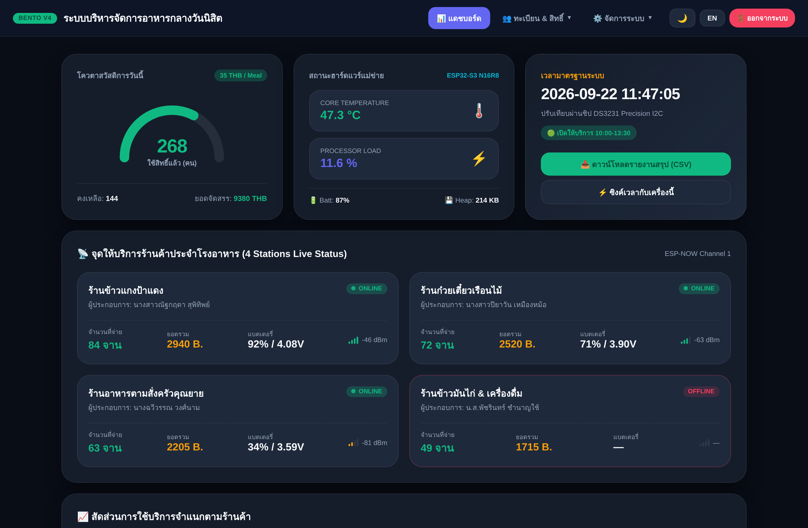
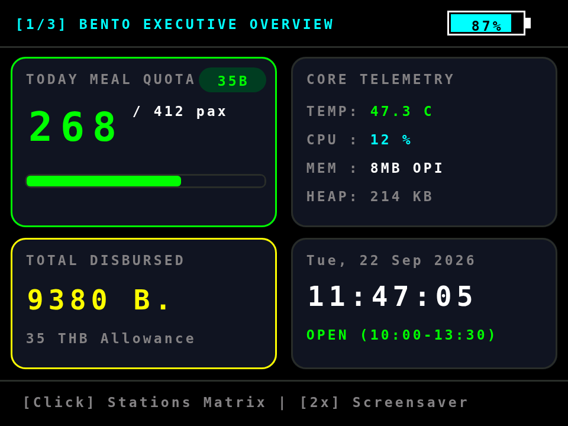
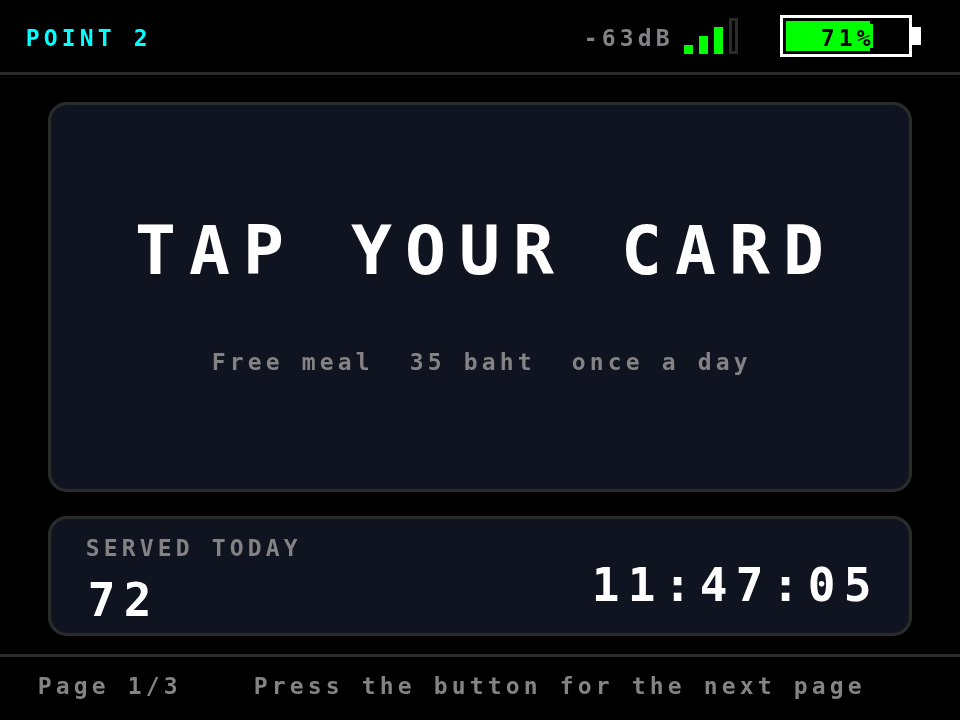
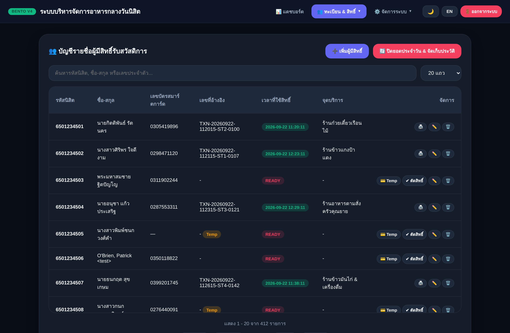
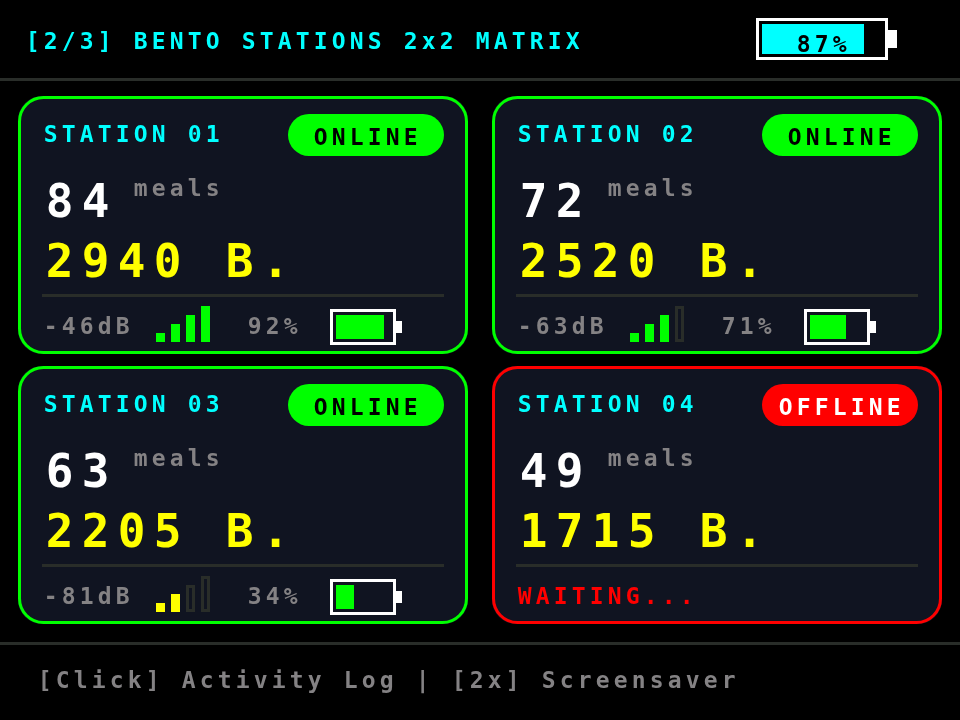
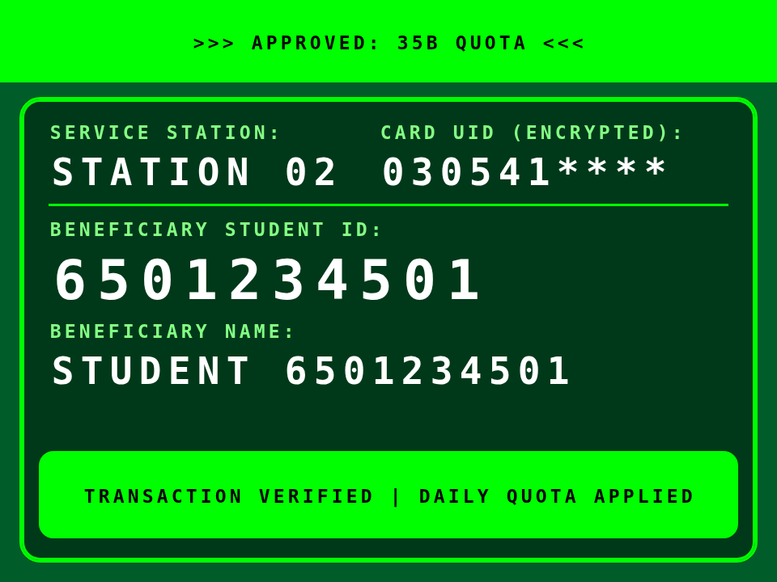
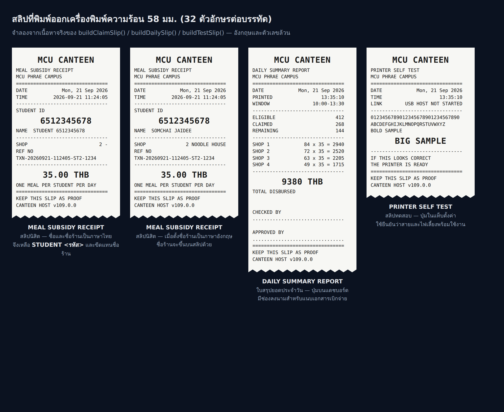

# MCU Phrae Smart Canteen — ระบบบริหารจัดการอาหารกลางวันนิสิต

ระบบคูปองอาหารดิจิทัล (โควตา 35 บาท/คน/วัน) ของมหาวิทยาลัยมหาจุฬาลงกรณราชวิทยาลัย
วิทยาเขตแพร่ ประกอบด้วยเฟิร์มแวร์ ESP32-S3 สองฝั่งที่คุยกันผ่าน ESP-NOW

> 📌 **ย้อนกลับไปใช้เวอร์ชันเก่า** — ทุกรุ่นของทั้งสองฝั่งอยู่บน GitHub แล้ว
> กดโหลด zip ได้เลยจาก [`VERSIONS.md`](VERSIONS.md) ·
> **ต้นฉบับก่อนแก้ไข** เก็บไว้ครบที่ [`original/`](original/)

| โฟลเดอร์ | บทบาท | เวอร์ชัน |
|---|---|---|
| `Canteen_Host_Server/` | เครื่องแม่ข่าย: ฐานข้อมูลนิสิต, RTC, เว็บพอร์ทัล, เครื่องพิมพ์สลิป | 110.0.2 |
| `Canteen_Station_Client/` | เครื่องลูกข่ายประจำร้านค้า: อ่านบัตร RFID แล้วถามสิทธิ์จากแม่ข่าย | 120.0.1 |

### โครงสร้างไฟล์ของสเก็ตช์แม่ข่าย

```
Canteen_Host_Server/
├── Canteen_Host_Server.ino   ตรรกะของระบบ: ESP-NOW, จอ TFT, ไฟล์ข้อมูล, เส้นทาง API, เนื้อหาสลิป
├── WebPortal.h               หน้าเว็บล้วน ๆ: getLoginHTML(), getHTML() และ getDisplayHTML()
└── ThermalPrinter.h          ไดรเวอร์เครื่องพิมพ์ความร้อน 58 มม. (ESC/POS) — USB OTG หรือ UART
```

Arduino IDE จะแสดง `WebPortal.h` และ `ThermalPrinter.h` เป็นแท็บของสเก็ตช์เดียวกันโดยอัตโนมัติ
ขอเพียงเก็บสามไฟล์นี้ไว้ในโฟลเดอร์เดียวกัน การคอมไพล์และการอัปโหลดทำเหมือนเดิมทุกอย่าง

`WebPortal.h` ถูก `#include` ไว้ท้ายไฟล์หลักก่อน `setup()` เพราะโค้ดข้างในอ้างถึงตัวแปร
ส่วนกลางและฟังก์ชันช่วยเหลือที่ประกาศไว้ข้างบน — **อย่าย้าย `#include` ขึ้นไปไว้บนสุด**

ผู้พัฒนา: กิตติพันธ์ รัตนคร — นักวิชาการคอมพิวเตอร์

---

## ภาพหน้าจอ

ภาพหน้าจอทั้งหมด 43 ภาพอยู่ใน [`docs/interface/`](docs/interface/) และเปิดดูรวมกันได้ที่
[`docs/interface-gallery.html`](docs/interface-gallery.html)

| เว็บพอร์ทัล | จอเครื่องแม่ข่าย | จอเครื่องประจำร้านค้า |
|---|---|---|
|  |  |  |
| แดชบอร์ดที่ดึงตัวเลขสดทุก 3 วินาที | หน้า 1/3 ภาพรวมโควตา | หน้า 1/3 รอแตะบัตร |
|  |  |  |
| ทะเบียนผู้มีสิทธิ์ | หน้า 2/3 สถานะจุดบริการ 4 จุด | แจ้งผล APPROVED |



สลิปที่พิมพ์ออกเครื่องพิมพ์ความร้อน 58 มม. — สลิปนิสิต ใบสรุปยอดประจำวัน และสลิปทดสอบ

ภาพเว็บพอร์ทัลถ่ายจากหน้าเว็บจริงที่เฟิร์มแวร์สร้างขึ้น ส่วนภาพจอ TFT สร้างจากพิกัด สี
และข้อความชุดเดียวกับที่อยู่ในฟังก์ชันวาดจอของเฟิร์มแวร์ จึงตรงตามเลย์เอาต์จริง แต่รูปทรง
ตัวอักษรต่างจากฟอนต์ 5×7 ของ Adafruit GFX บนอุปกรณ์จริงเล็กน้อย

---

## ฮาร์ดแวร์

ทั้งสองฝั่งใช้ ESP32-S3 DevKitC-1 (N16R8) + จอ ST7789V 2.8" 320x240 + WS2812 บน GPIO 48

### Host Server
| อุปกรณ์ | ขา |
|---|---|
| TFT (บัส FSPI) | CS 10 · DC 11 · RST 12 · MOSI 13 · SCLK 14 · BLK 15 |
| DS3231 RTC (I2C) | SDA 4 · SCL 5 |
| Buzzer | 6 |
| ปุ่มกด | 2 (INPUT_PULLUP) |
| วัดแรงดันแบตเตอรี่ | 1 (ADC1_CH0, ตัวแบ่งแรงดัน 1:2) |

### Station Client
| อุปกรณ์ | ขา |
|---|---|
| TFT (**บัส HSPI**) | CS 10 · DC 11 · RST 12 · MOSI 13 · SCLK 14 · BLK 15 |
| RC522 (**บัส FSPI ผ่านตัวแปร `SPI`**) | SS 7 · SCK 4 · MOSI 5 · MISO 21 · RST 17 |
| Buzzer | 38 |
| ปุ่มกด | 2 (INPUT_PULLUP) |
| วัดแรงดันแบตเตอรี่ | 3 (ADC1_CH2, ตัวแบ่งแรงดัน 1:2) |

> **สำคัญ:** บน ESP32-S3 ตัวแปร `SPI` มาตรฐานผูกกับ FSPI (SPI2_HOST) และไลบรารี MFRC522
> เรียกใช้ตัวแปรนั้น จอจึงต้องอยู่บน HSPI (SPI3_HOST) มิฉะนั้นอุปกรณ์สองตัวจะแย่ง
> peripheral เดียวกันคนละขา และจอจะเพี้ยนหลัง `PCD_Init()`

## ข้อควรรู้เวลาแก้โค้ดต่อ

Arduino IDE **สร้างต้นแบบฟังก์ชัน (prototype) ให้เองอัตโนมัติ** แล้ววางไว้ใกล้หัวไฟล์
ซึ่งอยู่ **เหนือจุดที่นิยาม struct ของสเก็ตช์** ถ้าเพิ่มฟังก์ชันที่รับ struct ของโครงการ
เป็นพารามิเตอร์แล้วลืมประกาศล่วงหน้า จะคอมไพล์ไม่ผ่านด้วยข้อความชวนงงแบบนี้

```
error: variable or field 'fillStationConfig' declared void
error: 'HostConfigPacket' was not declared in this scope
```

ทุกฟังก์ชันแบบนั้นต้องมีบรรทัดประกาศอยู่ในบล็อก *Forward Declarations*
(อยู่หลังนิยามโครงสร้างทั้งหมด) ตรวจได้ด้วย

```sh
python3 tools/proto-check/protoscan.py \
  Canteen_Host_Server/Canteen_Host_Server.ino \
  Canteen_Station_Client/Canteen_Station_Client.ino
```

## ไลบรารีที่ต้องติดตั้ง

`Adafruit GFX` · `Adafruit ST7735/ST7789` · `ArduinoJson (v6)` · `RTClib` · `MFRC522`
บน Arduino ESP32 core 2.x หรือ 3.x (โค้ดครอบ `ESP_ARDUINO_VERSION_MAJOR` ไว้แล้ว)

การตั้งค่าบอร์ด: ESP32S3 Dev Module · Flash 16MB · PSRAM `OPI PSRAM` · Partition `16M Flash (3MB APP/9.9MB FATFS)` หรือที่มี LittleFS

---

## โปรโตคอล ESP-NOW (ช่อง 1, ไม่เข้ารหัส)

ทุกแพ็กเก็ตขึ้นต้นด้วย `magic = 0xCA` และ `version = 2` ฝั่งรับจะตรวจทั้งสองค่าก่อนเสมอ

| โครงสร้าง | ขนาด | ทิศทาง | ใช้เมื่อ |
|---|---|---|---|
| `StationPacket` | 50 ไบต์ | สถานี → แม่ข่าย | `MSG_HEARTBEAT (1)`, `MSG_SCAN_REQ (2)` |
| `HostResponsePacket` | 200 ไบต์ | แม่ข่าย → สถานี | `MSG_HEARTBEAT (1)`, `MSG_SCAN_RESP (3)` |
| `HostConfigPacket` | 8 ไบต์ | แม่ข่าย → สถานี | `MSG_CONFIG (4)` สั่งโหมดการแสดงผล: ธีม ไฟหน้าจอ และโหมดพักหน้าจอ (`stationId = 0` คือทุกสถานี) |
| `HostRosterPacket` | 206 ไบต์ | แม่ข่าย → สถานี | `MSG_ROSTER (5)` ผลักบัญชีสิทธิ์ย่อไปเก็บที่สถานี ครั้งละไม่เกิน 38 รายการ |

ตอนตอบ `MSG_HEARTBEAT` แม่ข่ายใช้ช่อง `message[32]` ที่ว่างอยู่ฝากภาพรวมทั้งระบบไปด้วย
รูปแบบ `ใช้สิทธิ์/ผู้มีสิทธิ์ทั้งหมด/เปิดบริการ/เวลาเปิด-เวลาปิด` เช่น `268/412/1/1000-1330`
สถานีจึงแสดงยอดรวมทั้งโรงอาหารและสถานะเปิด-ปิดบริการบนหน้า 2 ได้โดย
**ไม่ต้องขยายขนาดแพ็กเก็ต** เฟิร์มแวร์รุ่นเก่าไม่อ่านช่องนี้ จึงอัปเดตทีละเครื่องได้โดยระบบไม่พัง

ขนาดทั้งสามถูกยืนยันด้วย `static_assert` ทั้งสองฝั่ง ถ้าแก้โครงสร้างแล้วขนาดไม่ตรงจะคอมไพล์ไม่ผ่าน
แทนที่จะไปพังตอนใช้งานจริง

การกันแพ็กเก็ตซ้ำ: `MSG_SCAN_REQ` พกหมายเลขลำดับ (`seq`) ถ้าแม่ข่ายได้รับซ้ำจะส่งคำตอบเดิมกลับไป
โดยไม่ตัดสิทธิ์ซ้ำ ส่วนสถานีจะส่งซ้ำได้ไม่เกิน 6 ครั้ง ถี่ช่วงแรกแล้วห่างออก (120 ms + 150 ms ต่อครั้ง)

---

## เว็บพอร์ทัลเจ้าหน้าที่

เข้าผ่าน `http://192.168.4.1` หรือ `http://canteen.local` หลังต่อ Wi-Fi `MCU_CANTEEN_HOST`
บัญชีเริ่มต้น `admin` / `admin1234` (**ควรเปลี่ยนทันทีหลังติดตั้ง**)

### การเชื่อมต่อ Wi-Fi แล้วหน้าเข้าระบบเด้งขึ้นเอง (Captive Portal)

เมื่อโทรศัพท์หรือคอมพิวเตอร์ต่อ Wi-Fi `MCU_CANTEEN_HOST` ระบบปฏิบัติการจะยิงคำขอไปยัง
URL ที่ใช้ตรวจว่าเครือข่ายออกอินเทอร์เน็ตได้หรือไม่ เครื่องแม่ข่ายดักไว้ทั้งหมดด้วยสองกลไก

1. `DNSServer` ตอบทุกโดเมนกลับมาที่ `192.168.4.1` (ตั้ง TTL = 0 เพื่อไม่ให้เครื่องจำค่าไว้หลังตัดการเชื่อมต่อ)
2. `server.onNotFound()` ตอบ HTTP 302 พร้อม `Location` แบบ URL เต็มไปยังหน้าเข้าสู่ระบบ

เครื่องจึงรู้ว่าติดหน้าล็อกอินอยู่ แล้วเปิดหน้าต่างพอร์ทัลขึ้นมาเอง ครอบคลุม URL ตรวจสอบของ
Android (`generate_204`, `gen_204`), iOS/macOS (`hotspot-detect.html`), Windows
(`connecttest.txt`, `ncsi.txt`) และ Firefox (`success.txt`)

**ข้อควรรู้เมื่อใช้งานจริง**

- หน้าต่างที่เด้งขึ้นมาบน iOS คือ Captive Network Assistant ซึ่งเป็นเบราว์เซอร์ย่อส่วน
  คุกกี้ที่ได้จากการล็อกอินในหน้าต่างนี้จะไม่ถูกส่งต่อให้ Safari ถ้าเจ้าหน้าที่ต้องใช้งานนาน
  ให้เลือก "ใช้เครือข่ายนี้ตามที่เป็น" แล้วเปิด Safari ไปที่ `192.168.4.1` แทน
- Android อาจสลับกลับไปใช้เน็ตมือถือเองเพราะเครือข่ายนี้ออกอินเทอร์เน็ตไม่ได้
  ให้เลือก "ใช้เครือข่ายนี้ตามที่เป็น" เมื่อระบบถาม
- คนที่ไม่ใช่เจ้าหน้าที่จะเห็นลิงก์ไปหน้าสถานะโรงอาหารบนหน้าล็อกอิน (เมื่อเปิดใช้จอสาธารณะ)

### เส้นทาง API

| Method | Path | หน้าที่ |
|---|---|---|
| GET | `/api/students` | รายชื่อแบบแบ่งหน้า (`page`, `limit` สูงสุด 100, `search`) |
| GET | `/api/dashboard` | ตัวเลขสดทั้งหมด: โควตา, ฮาร์ดแวร์แม่ข่าย, สถานะจุดบริการ 4 จุด |
| GET | `/display` · `/api/display` | จอสาธารณะและข้อมูลของจอ — **ไม่ต้องเข้าสู่ระบบ** |
| GET | `/export.csv` | รายงานสรุปประจำวัน |
| GET | `/api/archive/download?file=arc_*.csv` | ดาวน์โหลดไฟล์ประวัติ |
| POST | `/api/student/save` · `/api/student/delete` | จัดการรายชื่อ |
| POST | `/api/tempcard/save` · `/api/tempcard/remove` | จัดการบัตรสำรอง |
| POST | `/api/claim/manual` | ตัดสิทธิ์ด้วยตนเอง |
| POST | `/api/admin/save` · `/api/admin/delete` | จัดการเจ้าหน้าที่ |
| POST | `/api/shops/save` · `/api/settings/time` · `/api/rtc/set` | ตั้งค่าระบบ |
| POST | `/api/system/reset` · `/api/archive/delete` | ปิดยอดประจำวัน / ลบไฟล์ประวัติ |
| POST | `/upload` | นำเข้ารายชื่อจาก CSV (upsert) |

คำสั่งที่เปลี่ยนแปลงข้อมูลเป็น **POST ทั้งหมด** และตอบกลับเป็น JSON `{"ok":bool,"msg":"..."}`
หน้าเว็บแสดงผลด้วย toast โดยไม่รีโหลดทั้งหน้า

---

## ความทนทานของลิงก์และโหมดออฟไลน์

เครื่องแม่ข่ายกับเครื่องประจำร้านค้าห่างกันราว 20 เมตร จึงตั้งค่าวิทยุและวางกลไกสำรองไว้ดังนี้

**การตั้งค่าวิทยุ** — กำลังส่ง 20 dBm (ค่าสูงสุดของ ESP32-S3) · เปิด `WIFI_PROTOCOL_LR`
คู่กับ 11b/g/n ทั้งสองฝั่ง (โทรศัพท์ยังต่อ Wi-Fi ได้ตามปกติ) · `WIFI_BW_HT20` · ปิด power save

**บังคับอัตราส่งระยะไกล (ค่าเริ่มต้นปิดไว้)** — ในไฟล์ทั้งสองฝั่งมี

```c
#define ESPNOW_FORCE_LONG_RANGE_RATE 0
```

ตั้งเป็น `1` **ทั้งสองไฟล์** แล้วแฟลชทั้งสองเครื่อง จะบังคับให้ ESP-NOW ใช้ LoRa 250 kbps
ซึ่งรับสัญญาณอ่อนได้ดีขึ้นมาก แลกกับความเร็วที่ระบบนี้ไม่ต้องการอยู่แล้ว
**ถ้าเปิดข้างเดียวทั้งสองเครื่องจะคุยกันไม่รู้เรื่อง** จึงตั้งค่าเริ่มต้นไว้ที่ปิด
ให้เปิดตอนที่ไม่มีนิสิตใช้บริการ และถ้าคอมไพล์ไม่ผ่านกับ core ที่ใช้อยู่ให้ตั้งกลับเป็น `0`

**การส่งซ้ำ** — สถานียิงซ้ำได้ 7 ครั้งภายใน 3 วินาที ถี่ช่วงแรกแล้วค่อยห่างออก
และถ้าชิปรายงานว่าส่งไม่ถึงจะยิงซ้ำทันทีโดยไม่รอครบช่วงเวลา
ทั้งสองฝั่งใช้ unicast ที่มี ARQ ในตัว และใช้ broadcast เฉพาะตอนยังไม่รู้จัก MAC ของอีกฝั่ง
แม่ข่ายยิงคำตอบการสแกนซ้ำได้อีก 2 ครั้งเมื่อชิปแจ้งว่าส่งไม่ถึง

### คิวออฟไลน์ของเครื่องประจำร้านค้า

เมื่อแม่ข่ายไม่ตอบภายในเวลาที่กำหนด **สถานีจะไม่ปฏิเสธนิสิต** แต่บันทึกการแตะบัตรลง NVS
แล้วขึ้นจอสีฟ้าบอกแม่ค้าว่าจ่ายอาหารได้เลย พอลิงก์กลับมาจะส่งเข้าระบบเองทีละรายการ
โดยใช้ `offlineTime` ในแพ็กเก็ตเป็นเวลารับสิทธิ์จริง ไม่ใช่เวลาที่ซิงค์

| เรื่อง | รายละเอียด |
|---|---|
| ความจุคิว | 48 รายการต่อสถานี เก็บใน NVS จึงไม่หายแม้ไฟดับ |
| กันซ้ำ | บัตรใบเดิมแตะซ้ำที่สถานีเดียวกันจะขึ้นว่าบันทึกไว้แล้ว ไม่เพิ่มรายการ |
| เวลารอ | ถ้ารู้อยู่แล้วว่าแม่ข่ายหลุด จะรอแค่ 1.5 วินาทีแทน 3 วินาที นิสิตไม่ต้องยืนรอนาน |
| การซิงค์ | เริ่มเองเมื่อได้รับ heartbeat จากแม่ข่าย ถ้าแม่ข่ายหายอีกจะเว้น 15 วินาทีก่อนลองใหม่ |
| เวลารับสิทธิ์ | ใช้เวลาตอนแตะบัตร และแม่ข่ายข้ามการตรวจช่วงเวลาบริการให้ รายการจึงไม่ถูกปฏิเสธเพราะซิงค์หลังปิดบริการ |
| ในรายงาน | ประเภทบัตรจะต่อท้ายว่า `(Offline)` เพื่อให้เจ้าหน้าที่แยกออกได้ |

### การตรวจสิทธิ์ตอนลิงก์ขาด (Host 110.0.0 / Station 120.0.0 ขึ้นไป)

เดิมคิวออฟไลน์รับบัตร **ทุกใบ** โดยไม่ตรวจอะไรเลย บัตรที่ไม่ได้ลงทะเบียนหรือบัตรที่ใช้สิทธิ์
ไปแล้วก็ได้อาหารไปก่อน แล้วค่อยไปตกตอนซิงค์ ซึ่งสายเกินกว่าจะเรียกคืนได้

ตอนนี้แม่ข่ายผลัก **บัญชีสิทธิ์ย่อ** ไปเก็บไว้ที่สถานีล่วงหน้า สถานีจึงตรวจได้เองตั้งแต่ตอนแตะ

| เรื่อง | รายละเอียด |
|---|---|
| เก็บอะไร | ค่าแฮช 32 บิต (FNV-1a) ของเลขบัตร + สถานะใช้สิทธิ์ = **5 ไบต์ต่อคน** |
| ความจุ | `ROSTER_MAX` 600 คน = 3 KB เก็บใน NVS จึงไม่หายเมื่อรีบูตกลางที่ลิงก์ขาด |
| ความเป็นส่วนตัว | สถานีไม่เคยได้รับเลขบัตรจริงหรือชื่อนิสิตเลย ถึงเครื่องหายก็ไม่มีข้อมูลส่วนบุคคลติดไป |
| ผลักเมื่อไร | ชุดเต็มเมื่อชุดผู้มีสิทธิ์เปลี่ยน (เพิ่ม ลบ แก้ไข บัตรสำรอง นำเข้า CSV ปิดยอด) และเมื่อสถานีรายงานว่าเลขรุ่นไม่ตรง |
| อัปเดตรายวัน | ตอนมีคนใช้สิทธิ์ส่งแค่รายการเดียว (สถานีละ 1 แพ็กเก็ต) ไม่ผลักทั้งชุดใหม่วันละ 268 รอบ |
| กันตกหล่น | สถานีฝากเลขรุ่นที่ถืออยู่ไปกับ heartbeat ทุกครั้ง ถ้าไม่ตรงแม่ข่ายผลักชุดเต็มให้ใหม่ภายในไม่กี่วินาที |

**หลักการสำคัญคือ "ไม่มั่นใจ ให้ปล่อยผ่าน"** เพราะการปฏิเสธนิสิตที่มีสิทธิ์จริงเสียหายกว่า
การปล่อยบัตรแปลกปลอมผ่านไปหนึ่งใบ ซึ่งแม่ข่ายจะปัดตกตอนซิงค์อยู่ดี
กรณีที่ถือว่าไม่มั่นใจแล้วกลับไปรับบัตรทุกใบเหมือนเดิมคือ

- ยังไม่เคยได้รับบัญชี หรือกำลังรับชุดใหม่อยู่
- จำนวนผู้มีสิทธิ์มากกว่า `ROSTER_MAX` (แดชบอร์ดจะขึ้นเตือนเป็นสีแดงที่การ์ดจุดบริการนั้น)
- **บัญชีค้างข้ามวัน** — ทุกชุดมีวันที่ติดไปด้วย ถ้าวันที่ไม่ตรงกับวันนี้ หรือนาฬิกาของสถานี
  ยังไม่เคยซิงค์กับแม่ข่าย จะไม่เชื่อสถานะ "ใช้สิทธิ์แล้ว" ของเมื่อวาน (ไม่งั้นเช้าวันถัดไป
  ที่เปิดเครื่องก่อนแม่ข่ายขึ้น นิสิตที่กินเมื่อวานจะถูกปฏิเสธทั้งหมด)
  แต่ยังตรวจได้อยู่ว่าบัตรใบไหน **ไม่อยู่ในทะเบียน** เพราะทะเบียนไม่ได้เปลี่ยนรายวัน

ดูสถานะได้สองที่: การ์ดจุดบริการบนแดชบอร์ด (`📋 รายชื่อออฟไลน์`) และหน้า 3/3
ของจอสถานีเอง (`OFFLINE CARD LIST`)

โปรโตคอลนี้มีชุดทดสอบอยู่ที่ [`tools/roster-test/`](tools/roster-test/) ซึ่งดึงฟังก์ชันจริง
ออกมาจากไฟล์ `.ino` ทั้งสองฝั่งแล้วคอมไพล์ด้วย `g++` เพื่อรันจำลองการคุยกันทั้งวงจร
ใช้แค่ `python3` กับ `g++` ไม่ต้องมี toolchain ของ ESP32

> **ข้อจำกัดที่ยังเหลืออยู่:** ระหว่างที่ขาดการเชื่อมต่อ สถานีแต่ละเครื่องยังไม่รู้ว่าอีกเครื่อง
> จ่ายใครไปแล้ว **ในช่วงเวลานั้น** ถ้านิสิตคนเดียวกันไปแตะสองร้านหลังลิงก์ขาดจะได้อาหารสองจาน
> ระบบจะจับได้ตอนซิงค์ และขึ้นเป็นรายการที่ถูกปฏิเสธบนจอสรุปของสถานี พร้อมปรากฏในบันทึก
> ให้เจ้าหน้าที่ตรวจสอบย้อนหลัง — ส่วนการใช้สิทธิ์ที่เกิด **ก่อน** ลิงก์ขาด ตอนนี้ถูกปัดตกได้แล้ว

## เครื่องพิมพ์สลิปความร้อน 58 มม. (Host 109.0.0 ขึ้นไป)

ไดรเวอร์อยู่ใน `ThermalPrinter.h` เป็นไฟล์อิสระที่ไม่รู้จักข้อมูลของระบบเลย
รับแค่สตริงไบต์ ESC/POS แล้วทยอยส่งออกแบบไม่บล็อกลูปหลัก ส่วนเนื้อหาสลิปประกอบใน
`Canteen_Host_Server.ino` (`buildClaimSlip()`, `buildDailySlip()`, `buildTestSlip()`)

### สวิตช์ที่หัวสเก็ตช์

```c
#define ENABLE_THERMAL_PRINTER 1   // 0 = ปิดทั้งระบบ ไม่กินแฟลช/แรม
#define PRINTER_TRANSPORT_UART 0   // 0 = USB OTG host, 1 = UART TTL
```

### การต่อสาย

| ช่องทาง | การต่อ | ข้อกำหนด |
|---|---|---|
| USB OTG (ค่าเริ่มต้น) | เสียบเครื่องพิมพ์เข้าพอร์ต USB เนทีฟของบอร์ด | ต้องจ่ายไฟ 5V เข้าขา VBUS ของพอร์ตนั้นเองจากแหล่งจ่ายภายนอก · `Tools > USB Mode` ต้องเป็น **Hardware CDC and JTAG** · เมื่อสแต็ก USB host ยึด GPIO 19/20 แล้ว พอร์ตเนทีฟจะใช้อัปโหลด/Serial Monitor ไม่ได้ ให้ใช้พอร์ต UART แทน |
| UART TTL (ทางสำรอง) | GPIO 17 = TX → RX ของเครื่องพิมพ์ · GPIO 18 = RX · ร่วม GND | 9600 8N1 ปรับได้ที่ `PRINTER_BAUD` |

> **ไฟเลี้ยง:** หัวพิมพ์ความร้อนกินกระแสพีค 1.5–2 A เครื่องพิมพ์ต้องมีแหล่งจ่ายของตัวเอง
> ห้ามดึงไฟจากบอร์ด ESP32 เด็ดขาด ต่อร่วมกันได้แค่สาย GND

### พฤติกรรม

- **พิมพ์อัตโนมัติทุกครั้ง** ที่ตัดสิทธิ์สำเร็จ ทั้งจากการแตะบัตรและจากการตัดสิทธิ์ด้วยตนเองบนเว็บ
  เปิด/ปิดได้ที่แท็บ ⚙️ ตั้งค่า (จำค่าไว้ใน NVS คีย์ `prn_auto`)
- **รายการที่ซิงค์ย้อนหลัง** หลังลิงก์ขาดจะไม่พิมพ์อัตโนมัติ เพราะนิสิตรับอาหารและกลับไปแล้ว
  ยอดยังอยู่ครบในใบสรุปประจำวันและไฟล์ CSV
- ปุ่ม 🖨️ ในตารางรายชื่อ = พิมพ์สลิปของรายการนั้นซ้ำ (เฉพาะรายการที่ตัดสิทธิ์แล้ว)
- ปุ่ม 🖨️ พิมพ์ใบสรุปประจำวัน บนแดชบอร์ด = ใบสรุปยอดรายร้านพร้อมช่องลงนาม
- คิวพักได้ 8 ใบ ถ้าคิวเต็มจะทิ้งใบใหม่ทิ้ง **ไม่บล็อกการตัดสิทธิ์**
  และใบที่ค้างคิวเกิน 2 นาทีโดยไม่พบเครื่องพิมพ์จะถูกทิ้งไปเอง กันการพ่นสลิปเก่ารวดเดียวตอนเสียบทีหลัง

### ข้อจำกัดของเนื้อหาสลิป

หัวพิมพ์ราคาประหยัดไม่มีฟอนต์ไทยในตัว สลิปทั้งหมดจึงเป็น **อังกฤษและตัวเลขล้วน**

- ชื่อนิสิตภาษาไทย → แทนด้วย `STUDENT <รหัสนิสิต>` อัตโนมัติ
- ชื่อร้านภาษาไทย → เหลือแค่หมายเลขร้าน ถ้าต้องการให้ชื่อร้านขึ้นบนสลิปด้วย
  ให้ตั้งชื่อร้านเป็นภาษาอังกฤษในแท็บ 🏪 ร้านค้า

### ปลายทาง API

| เส้นทาง | วิธี | หน้าที่ |
|---|---|---|
| `/api/print/test` | POST | พิมพ์สลิปทดสอบ |
| `/api/print/slip` | POST (`id`) | พิมพ์สลิปของนิสิตรายนั้นซ้ำ |
| `/api/print/daily` | POST | พิมพ์ใบสรุปยอดประจำวัน |
| `/api/settings/printer` | POST (`auto`) | เปิด/ปิดการพิมพ์อัตโนมัติ |

สถานะเครื่องพิมพ์ถูกส่งมากับ `/api/dashboard` ในคีย์ `printer`
(`enabled` / `ready` / `auto` / `queue` / `status`) แดชบอร์ดจึงแสดงสถานะสดทุก 3 วินาที

---

## จอสาธารณะสำหรับมอนิเตอร์จอใหญ่

เปิด `http://192.168.4.1/display` บนเครื่องที่ต่อกับมอนิเตอร์ในโรงอาหาร แล้วกด F11 ให้เต็มจอ
หน้านี้รีเฟรชตัวเองทุก 2 วินาที แสดงยอดใช้สิทธิ์ ยอดจัดสรร รายการที่ตัดสิทธิ์ล่าสุด
และสถานะร้านค้าทั้งสี่ ขนาดตัวอักษรอิงหน่วย `vmin` จึงปรับตามขนาดจอเองโดยไม่ต้องตั้งค่า

**สิ่งที่หน้านี้ไม่แสดง เพื่อความเป็นส่วนตัวของนิสิต**

- ไม่มีชื่อ-สกุล ไม่มีเลขบัตรสมาร์ตการ์ด ไม่มีเลขที่อ้างอิงธุรกรรม
- รหัสนิสิตปิดบังเหลือห้าหลักแรก เช่น `65012*****` พอให้เจ้าตัวจำได้ว่าเป็นของตน
- แสดงเฉพาะรายการที่ตัดสิทธิ์**สำเร็จ** ไม่แสดงบัตรซ้ำหรือบัตรที่ไม่อยู่ในทะเบียน
- ไม่มีเมนู ไม่มีปุ่มสั่งงาน และเปิดไปหน้าอื่นของระบบไม่ได้
- ข้อมูลมาจาก `/api/display` ซึ่งเป็นคนละชุดกับ `/api/dashboard` ของเจ้าหน้าที่

หน้านี้เปิดดูได้โดยไม่ต้องเข้าสู่ระบบ จึงไม่กินช่องผู้ใช้งาน (ระบบรองรับเจ้าหน้าที่พร้อมกัน 3 บัญชี)
ปิดการใช้งานได้ที่แท็บ **จัดการระบบ → กำหนดเวลา & ระบบ** เมื่อปิดแล้วผู้ที่ไม่ได้เข้าสู่ระบบจะเปิดหน้านี้ไม่ได้

> ทุกคนที่ต่อ Wi-Fi `MCU_CANTEEN_HOST` ได้จะเปิดหน้านี้ได้ทั้งหมด ถ้าไม่ต้องการให้เปิดจากเครื่องอื่น
> ให้ปิดการใช้งานไว้ หรือเปลี่ยนรหัสผ่าน Wi-Fi จากค่าเริ่มต้น

## ไฟล์ข้อมูลใน LittleFS

| ไฟล์ | เนื้อหา |
|---|---|
| `/students.csv` | ทะเบียนนิสิต `studentId,fullName,uid` (ทุกฟิลด์ครอบด้วยเครื่องหมายคำพูด) |
| `/daily_log.csv` | บันทึกการรับสิทธิ์ของวัน ใช้กู้สถานะเมื่อไฟดับแล้วบูตใหม่ |
| `/arc_YYYYMMDD_HHMMSS.csv` | ไฟล์ประวัติที่ถูกจัดเก็บตอนปิดยอดประจำวัน |
| `/admins.json` | บัญชีเจ้าหน้าที่ |
| `/shops.json` | ชื่อร้านและผู้ประกอบการ |

ไฟล์ CSV ทุกไฟล์เขียนและอ่านผ่าน `csvQuote()` / `parseCsvLine()` ที่เข้าใจเครื่องหมายคำพูด
ชื่อที่มีลูกน้ำจึงไม่ทำให้ระเบียนเพี้ยน และยังอ่านไฟล์รุ่นเก่าที่ไม่มีเครื่องหมายคำพูดได้

---

## การใช้งานปุ่มกด

| การกด | Host Server | Station Client |
|---|---|---|
| คลิก 1 ครั้ง | เปลี่ยนหน้า (3 หน้า) | เปลี่ยนหน้า (3 หน้า) |
| คลิก 2 ครั้ง | เข้าโหมดพักหน้าจอ **+ สั่งทุกสถานีตาม** | เข้าโหมดพักหน้าจอเฉพาะเครื่องนี้ |
| คลิก 3 ครั้ง | สลับธีมสว่าง/มืด **+ สั่งทุกสถานีตาม** | แจ้งว่าธีมถูกกำหนดจากแม่ข่าย |
| กดค้าง 1.5 วินาที | ปิด/เปิดไฟหน้าจอ **+ สั่งทุกสถานีตาม** | ปิด/เปิดไฟหน้าจอเฉพาะเครื่องนี้ |
| กดค้าง 3 วินาที | — | ตั้งหมายเลขสถานี (01-04) |
| กดค้าง 5 วินาที | หน้าเครดิตผู้พัฒนา | หน้าเครดิตผู้พัฒนา |

### โหมดการแสดงผลถูกควบคุมจากเครื่องแม่ข่าย

เครื่องแม่ข่ายเป็นเจ้าของโหมดการแสดงผลของทั้งระบบ และส่งคำสั่งผ่าน `HostConfigPacket`
(`MSG_CONFIG`) ทั้งแบบ broadcast ทันทีที่โหมดเปลี่ยน และย้ำอีกครั้งทุกครั้งที่ตอบ heartbeat
สถานีที่เพิ่งบูตหรือที่พลาดคำสั่ง broadcast จึงกลับมาตรงกับแม่ข่ายภายในไม่กี่วินาที

| สิ่งที่ซิงค์ | พฤติกรรม |
|---|---|
| ธีมสว่าง/มืด | **บังคับเสมอ** สถานีเปลี่ยนตามทุกครั้งที่ค่าไม่ตรงกับแม่ข่าย |
| โหมดพักหน้าจอ | สถานีทำตามเมื่อแม่ข่ายเข้า/ออกโหมดพักหน้าจอ (ทั้งการกดเองและการหมดเวลา 5 นาที) |
| ไฟหน้าจอ | สถานีทำตามเมื่อเจ้าหน้าที่กดปิด/เปิดจอที่แม่ข่าย |

โหมดพักหน้าจอและไฟหน้าจอเป็นคำสั่งแบบ "สั่งเมื่อเปลี่ยน" (ดูจากค่า `modeSeq` ที่เพิ่มขึ้น)
สถานีจึงยังกดปิดจอของตัวเองได้ และจะไม่ถูกแม่ข่ายสั่งเปิดกลับทุกรอบ heartbeat
ส่วนธีมเป็นคำสั่งแบบบังคับ การกดสามครั้งที่สถานีจึงขึ้นหน้าแจ้งเตือนแทนการสลับเอง

ข้อยกเว้นที่ตั้งใจไว้: ถ้ามีคนแตะบัตรขณะระบบพักหน้าจอ สถานีนั้นจะตื่นขึ้นแสดงผลทันที
และแม่ข่ายจะปลุกทุกสถานีพร้อมกัน เพราะถือว่ากลับมาให้บริการแล้ว
ถ้าสถานีขาดการเชื่อมต่อกับแม่ข่าย จะกลับไปใช้การหมดเวลา 5 นาทีของตัวเองตามปกติ

---

## ข้อควรทราบด้านความปลอดภัย

- รหัสผ่านเจ้าหน้าที่เก็บเป็นข้อความธรรมดาใน `/admins.json` — เครื่องนี้จึงควรอยู่ในพื้นที่ควบคุม
- ESP-NOW ไม่ได้เข้ารหัส ผู้ที่อยู่ในระยะสามารถดักฟังหมายเลขบัตรได้
- Wi-Fi AP ใช้รหัสผ่านเริ่มต้น `12345678` ควรเปลี่ยนก่อนใช้งานจริง

รายละเอียดสิ่งที่แก้ไขทั้งหมดอยู่ใน [CHANGELOG.md](CHANGELOG.md)
