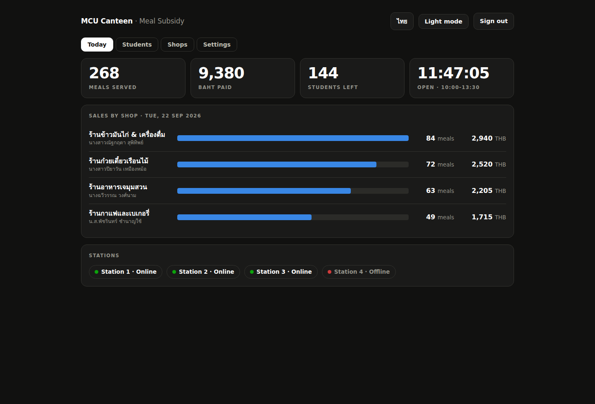

# MCU Phrae Smart Canteen — ระบบบริหารจัดการอาหารกลางวันนิสิต

ระบบคูปองอาหารดิจิทัล (โควตา 35 บาท/คน/วัน) ของมหาวิทยาลัยมหาจุฬาลงกรณราชวิทยาลัย
วิทยาเขตแพร่ ประกอบด้วยเฟิร์มแวร์ ESP32-S3 สองฝั่งที่คุยกันผ่าน ESP-NOW

> 📌 **ย้อนกลับไปใช้เวอร์ชันเก่า** — ทุกรุ่นของทั้งสองฝั่งอยู่บน GitHub แล้ว
> กดโหลด zip ได้เลยจาก [`VERSIONS.md`](VERSIONS.md) ·
> **ต้นฉบับก่อนแก้ไข** เก็บไว้ครบที่ [`original/`](original/)

| โฟลเดอร์ | บทบาท | เวอร์ชัน |
|---|---|---|
| `Canteen_Host_Server/` | เครื่องแม่ข่าย: ฐานข้อมูลนิสิต, นาฬิกา RTC, เว็บสำหรับเจ้าหน้าที่ | 113.1.0 |
| `Canteen_Station_Client/` | เครื่องประจำร้านค้า: อ่านบัตร RFID แล้วถามสิทธิ์จากแม่ข่าย | 122.1.0 |

> รุ่น 113.0.0 / 122.0.0 **เริ่มใหม่จากไฟล์ต้นฉบับ 107.0.1 / 117.0.7** ไม่ได้ต่อยอด
> จากสายเดิม ฟีเจอร์ที่เคยมีในสายเดิมบางอย่าง (เครื่องพิมพ์สลิป, คิวออฟไลน์,
> จอสาธารณะ `/display`) **ยังไม่ถูกใส่กลับเข้ามาในรุ่นนี้** ถ้าต้องการให้ใช้
> `release/11` หรือเก่ากว่า รายละเอียดอยู่ใน [`CHANGELOG.md`](CHANGELOG.md)

### โครงสร้างไฟล์

ทั้งสองฝั่งแยกส่วนวาดจอออกมาเป็นไฟล์ของตัวเองเหมือนกัน

```
Canteen_Host_Server/
├── Canteen_Host_Server.ino      ตรรกะระบบ ฐานข้อมูล ESP-NOW เส้นทางเว็บ  (2,052 บรรทัด)
├── HostScreen.h                 ทุกอย่างที่วาดลงจอ TFT ของแม่ข่าย           (836 บรรทัด)
└── WebDashboard.h               หน้าเว็บ แดชบอร์ด + จอสาธารณะบนทีวี          (936 บรรทัด)

Canteen_Station_Client/
├── Canteen_Station_Client.ino   ตรรกะระบบ อ่านบัตร ESP-NOW ปุ่มกด          (1,183 บรรทัด)
└── StationScreen.h              ทุกอย่างที่วาดลงจอ TFT ของจุดบริการ          (948 บรรทัด)
```

ไฟล์ `.h` เหล่านี้ถูก `#include` ไว้ **ท้ายไฟล์หลักก่อน `setup()`** เพราะโค้ดข้างใน
อ้างถึงตัวแปรส่วนกลางที่ประกาศไว้ข้างบน **อย่าย้าย `#include` ขึ้นไปบนสุด**
Arduino IDE จะแสดงทุกไฟล์เป็นแท็บของสเก็ตช์เดียวกัน เปิดพร้อมกันได้เลย

> ⚠️ ฟังก์ชันที่นิยามในไฟล์ `.h` จะ "มาทีหลัง" โค้ดทุกบรรทัดเหนือบรรทัด `#include`
> ถ้าโค้ดข้างบนเรียกใช้โดยไม่มีการประกาศล่วงหน้า **จะคอมไพล์ไม่ผ่าน**
> และค่าปริยายของพารามิเตอร์ต้องอยู่ที่การประกาศล่วงหน้าเท่านั้น ใส่ซ้ำที่นิยามไม่ได้
> ตรวจทั้งสองข้อได้ด้วย `python3 tools/proto-check/splitcheck.py`
>
> ⚠️ กติกาเดียวกันนี้ใช้ **ภายในไฟล์ `.h` เอง** ด้วย ฟังก์ชันที่ถูกเรียกต้องนิยามอยู่ข้างบน
> หรือมีบรรทัดประกาศล่วงหน้าอยู่ข้างบน จะอยู่ใน `.h` เดียวกันหรืออยู่ใน `.ino`
> เหนือบรรทัด `#include` ก็ได้ เพราะคอมไพเลอร์เห็นทั้งสองไฟล์เป็นไฟล์เดียวกัน
> ตรวจด้วย `python3 tools/proto-check/ordercheck.py`

---

## อินเตอร์เฟส

**หน้าเว็บเป็นสองภาษา ไทย/อังกฤษ** กดปุ่มบนแถบบนเพื่อสลับ เบราว์เซอร์จำค่าที่เลือกไว้
ค่าเริ่มต้นเป็นอังกฤษเพราะนิสิตส่วนใหญ่เป็นชาวต่างชาติ ส่วนหน้าเข้าสู่ระบบสลับได้เช่นกัน

**จอ TFT ทั้งสองฝั่งเป็นภาษาอังกฤษอย่างเดียว** เพราะฟอนต์ในตัวไลบรารี Adafruit GFX
ไม่มีตัวอักษรไทย ถ้าจะให้เป็นไทยต้องฝังฟอนต์บิตแมปเข้าไปเอง ซึ่งกินแฟลชเพิ่มมาก

> ⚠️ ถ้ามีภาษาไทยหลุดไปถึงจอ จะไม่ใช่แค่อ่านไม่ออก แต่ **ตัวอักษรจะซ้อนทับกัน**
> เพราะภาษาไทยหนึ่งตัวกินสามไบต์ จอจึงวาดเป็นสัญลักษณ์สามตัวและกว้างกว่าที่นับไว้สามเท่า
> ทุกข้อความที่มาจากผู้ใช้หรือฐานข้อมูลจึงผ่าน `asciiOnly()` ก่อนถึงจอเสมอ
> และ **ชื่อร้านมีช่องแยกสำหรับขึ้นจอโดยเฉพาะ** ตั้งได้จากแท็บ Shops บนหน้าเว็บ

มีสองโหมดสี **สว่าง** และ **มืด** เครื่องแม่ข่ายเป็นผู้กำหนดให้ทั้งระบบ

### คำแปลทำงานอย่างไร

ข้อความอังกฤษเขียนไว้ใน HTML ตามปกติแล้วติดป้าย `data-i="คีย์"` ส่วนคำไทยอยู่ใน
พจนานุกรมชุดเดียวชื่อ `TH` ที่หัวของ `DASH_JS` **ไม่ได้เขียนซ้ำสองชุดในทุกบรรทัด**
แบบที่เฟิร์มแวร์รุ่นเก่าทำ เวลาเพิ่มข้อความใหม่จึงแก้แค่สองที่ คือติดป้ายที่ HTML
กับเติมอีกหนึ่งบรรทัดในพจนานุกรม

ถ้าลืมเติมคำแปล หน้าเว็บจะแสดงภาษาอังกฤษไว้ก่อน ไม่พังและไม่กลายเป็นช่องว่าง

### หน้าเว็บของเจ้าหน้าที่

| แท็บ | มีอะไร |
|---|---|
| **Today** | จำนวนจานที่จ่ายวันนี้ · เป็นเงินเท่าไร · เหลืออีกกี่คน · นาฬิกาและสถานะเปิดบริการ<br>ยอดขายรายร้านเป็นแท่งเทียบกัน และสถานะของจุดบริการทั้งสี่จุด |
| **Students** | ค้นหา เพิ่ม ลบ ตัดสิทธิ์ด้วยตนเอง ผูกบัตรชั่วคราว และดาวน์โหลด CSV |
| **Shops** | ชื่อร้านและชื่อผู้ประกอบการทั้งสี่ร้าน |
| **Settings** | โหมดการแสดงผลของทุกจุดบริการ · เวลาเปิดบริการ · นาฬิกา · นำเข้ารายชื่อ<br>บัญชีเจ้าหน้าที่ · ไฟล์ประวัติย้อนหลัง · ปิดยอดประจำวัน |

ทุกแท็บสลับไทย/อังกฤษได้ รวมถึงข้อความแจ้งเตือนและกล่องถามยืนยันก่อนลบ

### จอของเครื่องแม่ข่าย (3 หน้า)

| หน้า | มีอะไร |
|---|---|
| **TODAY** | จำนวนจาน เงินที่จ่าย นาฬิกา และป้ายเปิด/ปิดบริการ |
| **SHOPS** | สี่ช่อง ช่องละร้าน ขึ้นชื่อร้านก่อนเลขจุดบริการ พร้อมจุดสถานะ สัญญาณ และแบตเตอรี่ |
| **SYSTEM** | ผลการแตะบัตรครั้งล่าสุด ข้อมูลเครือข่าย และข้อมูลเครื่อง |

### จอของเครื่องประจำร้านค้า (3 หน้า)

| หน้า | มีอะไร |
|---|---|
| **หน้าแรก** | สัญลักษณ์แตะบัตรกับประโยคเดียวที่นิสิตต้องอ่าน **TAP YOUR CARD** พร้อมยอดวันนี้และเวลา · คลื่นของสัญลักษณ์เป็นสีเขียวเมื่อเครื่องอ่านบัตรยังตอบอยู่ และเป็นสีแดงพร้อมบรรทัดบอกให้ตามเจ้าหน้าที่เมื่อไม่ตอบ |
| **หน้าสอง** | ยอดของจุดนี้ หมายเลขจุด สถานะการเชื่อมต่อ และเวลา |
| **SYSTEM** | ข้อมูลเครื่องสำหรับคนดูแล |

ผลการแตะบัตรขึ้นเต็มจอเป็นคำเดียวตัวโต: `APPROVED` · `ALREADY SERVED` ·
`CLOSED NOW` · `NOT ON THE LIST` พร้อมประโยคอธิบายหนึ่งบรรทัดด้านล่าง

---

## ภาพหน้าจอ

ภาพทั้งหมดอยู่ใน [`docs/interface/`](docs/interface/) และเปิดดูพร้อมคำอธิบายทีละภาพได้ที่
[`docs/interface-gallery.html`](docs/interface-gallery.html) (โหลดไฟล์แล้วเปิดด้วยเบราว์เซอร์)

| | |
|---|---|
|  |  |
| **Today** — สิ่งที่เจ้าของร้านอยากรู้อยู่หน้าแรก | โหมดสว่าง ใช้ชุดสีที่ปรับแยกกัน |
|  |  |
| จอแม่ข่าย หน้า **TODAY** | จอแม่ข่าย หน้า **SHOPS** |
|  |  |
| จอประจำร้านค้า มีประโยคเดียวที่นิสิตต้องอ่าน | ผลการแตะบัตร คำเดียวตัวโต |

ภาพจอ TFT ทั้งหมดเรนเดอร์จากตัวจำลอง Adafruit GFX บนผืนผ้าใบ 320x240
ภาพหน้าเว็บเรนเดอร์จากหน้าจริงที่ประกอบจาก `WebDashboard.h` ด้วย Chromium
ข้อมูลในภาพเป็นชุดตัวอย่างสำหรับสาธิต

---

## ฮาร์ดแวร์

ทั้งสองฝั่งใช้ ESP32-S3 DevKitC-1 (N16R8) + จอ ST7789V 2.8" 320x240 + WS2812 บน GPIO 48

**อุปกรณ์ภายนอกทุกตัวอยู่บนแถวซ้ายของบอร์ดแถวเดียว** แถวขวาไม่ได้ต่ออะไรเลย
และขาของแต่ละโมดูลเรียงติดกันตามลำดับขาบนตัวโมดูลเอง สายจึงไม่มีเส้นไหนไขว้กัน

### Host Server
| อุปกรณ์ | ขา | ตำแหน่งบนแถวซ้าย |
|---|---|---|
| TFT (บัส FSPI) | BLK 9 · CS 10 · DC 11 · RES 12 · SDA 13 · SCL 14 | 15–20 |
| DS3231 RTC (I2C) | SDA 4 · SCL 5 | 4–5 |
| Buzzer | 17 | 10 |
| ปุ่มกด | 18 (INPUT_PULLUP) | 11 |
| วัดแรงดันแบตเตอรี่ | 8 (ADC1_CH7, ตัวแบ่งแรงดัน 1:2) | 12 |

### Station Client
| อุปกรณ์ | ขา | ตำแหน่งบนแถวซ้าย |
|---|---|---|
| TFT (**บัส HSPI**) | BLK 9 · CS 10 · DC 11 · RES 12 · SDA 13 · SCL 14 | 15–20 |
| RC522 (**บัส FSPI ผ่านตัวแปร `SPI`**) | SS 4 · SCK 5 · MOSI 6 · MISO 7 · RST 15 | 4–8 |
| Buzzer | 17 | 10 |
| ปุ่มกด | 18 (INPUT_PULLUP) | 11 |
| วัดแรงดันแบตเตอรี่ | 8 (ADC1_CH7, ตัวแบ่งแรงดัน 1:2) | 12 |

บัซเซอร์ ปุ่มกด และสายวัดแบตเตอรี่ **ใช้ขาเดียวกันทั้งสองบอร์ด**
ประกอบสายชุดเดียวแล้วสลับใช้ได้ทั้งสองฝั่ง

> **สำคัญ:** บน ESP32-S3 ตัวแปร `SPI` มาตรฐานผูกกับ FSPI (SPI2_HOST) และไลบรารี MFRC522
> เรียกใช้ตัวแปรนั้น จอจึงต้องอยู่บน HSPI (SPI3_HOST) มิฉะนั้นอุปกรณ์สองตัวจะแย่ง
> peripheral เดียวกันคนละขา และจอจะเพี้ยนหลัง `PCD_Init()`

> ⚠️ บนรุ่น **N16R8** ขา `GPIO33`–`GPIO37` ถูก **PSRAM แบบ OPI** จองไว้
> ถึงแม้ `GPIO35` `GPIO36` `GPIO37` จะโผล่อยู่บนแถวขวาของบอร์ดก็ห้ามใช้
> ตรวจได้ด้วย `python3 tools/proto-check/pincheck.py`

**ผังการต่อสายเต็ม ๆ พร้อมลำดับขาของทุกโมดูล อยู่ใน
[`docs/HARDWARE.md`](docs/HARDWARE.md)**

---

## ไลบรารีที่ต้องติดตั้ง

`Adafruit GFX` · `Adafruit ST7735/ST7789` · `ArduinoJson (v6)` · `RTClib` · `MFRC522`
บน Arduino ESP32 core 2.x หรือ 3.x (โค้ดครอบ `ESP_ARDUINO_VERSION_MAJOR` ไว้แล้ว)

### การตั้งค่าบอร์ดใน Arduino IDE

| หัวข้อใน Tools | ต้องตั้งเป็น |
|---|---|
| Board | ESP32S3 Dev Module |
| Flash Size | **16MB (128Mb)** |
| PSRAM | **OPI PSRAM** |
| Partition Scheme | **Huge APP (3MB No OTA/1MB SPIFFS)** |
| USB Mode | Hardware CDC and JTAG |

> ⚠️ **Partition Scheme สำคัญมาก เลือกผิดแล้วอัปโหลดไม่ได้เลย**
>
> ถ้าใช้ค่าเริ่มต้น *Default 4MB with spiffs* จะได้พื้นที่โปรแกรมแค่ **1.25 MB**
> ซึ่งไม่พอ เฟิร์มแวร์แม่ข่ายจะขึ้นว่า `Sketch too big` ทั้งที่บอร์ดมีแฟลช 16 MB
> พอเปลี่ยนเป็น *Huge APP* จะได้ 3 MB
>
> **ห้ามเลือกแบบที่ลงท้ายด้วย FATFS** (เช่น *16M Flash (3MB APP/9.9MB FATFS)*)
> เพราะโค้ดเรียก `LittleFS.begin(true)` ซึ่งมองหาพาร์ทิชันชื่อ `spiffs`
> ส่วนแบบ FATFS ตั้งชื่อพาร์ทิชันว่า `ffat` ทำให้เมานต์ไม่ขึ้นและ
> **ฐานข้อมูลนิสิตทั้งหมดหายไป** ต้องเป็นแบบที่ลงท้ายด้วย SPIFFS เท่านั้น

---

## แก้ปัญหาที่พบบ่อย

### ไม่มีชื่อ Wi-Fi `MCU_CANTEEN_HOST` ขึ้นมาให้เลือก

เครื่องแม่ข่าย **ขึ้นจอบอกสถานะเครือข่ายให้เองตอนบูต** ค้างไว้สามวินาที
ดูที่จอของเครื่องแม่ข่ายก่อนเสมอ

| สิ่งที่เห็นบนจอ | แปลว่า | ทำอย่างไร |
|---|---|---|
| แถบเขียว **WI-FI IS ON** พร้อมชื่อ รหัสผ่าน และเลข IP | เครื่องปล่อยสัญญาณแล้ว | ปัญหาอยู่ที่อุปกรณ์ที่ใช้ค้นหา ลองปิด-เปิด Wi-Fi ของโทรศัพท์ หรือลืมเครือข่ายเดิมแล้วค้นใหม่ |
| แถบแดง **WI-FI FAILED TO START** | เรียก `WiFi.softAP()` ไม่สำเร็จสามครั้งติด | ถอดไฟแล้วเสียบใหม่ ถ้ายังเป็นอีกให้แฟลชใหม่ (การอ่านบัตรยังทำงานได้ตามปกติ) |
| จอไม่ขึ้นอะไรเลย หรือค้างที่แอนิเมชันบูต | เครื่องแพนิกหรือบูตวน | ดูข้อความบน Serial Monitor ที่ 115200 |

> **เคยเกิดขึ้นจริงมาแล้ว** ในสายเฟิร์มแวร์เดิม สาเหตุคือ `WIFI_PROTOCOL_LR`
> ซึ่งเป็นโหมดระยะไกลเฉพาะของ Espressif ทำให้โทรศัพท์และคอมพิวเตอร์
> **มองไม่เห็นชื่อ Wi-Fi** ทั้งที่เครื่องปล่อยสัญญาณอยู่
> รุ่นนี้เริ่มใหม่จากต้นฉบับซึ่งไม่มีบรรทัดนั้นแล้ว ถ้าจะเพิ่มโหมดระยะไกลในอนาคต
> **ต้องทดสอบกับโทรศัพท์จริงก่อนเสมอ**

### เข้า `canteen.local` ไม่ได้

Android บางรุ่นไม่รองรับ mDNS ให้พิมพ์ `192.168.4.1` ตรง ๆ แทน
(จอตอนบูตแสดงหมายเลขนี้ไว้ให้แล้ว)

---

## ข้อควรรู้เวลาแก้โค้ดต่อ

Arduino IDE **สร้างต้นแบบฟังก์ชัน (prototype) ให้เองอัตโนมัติ** แล้ววางไว้ใกล้หัวไฟล์
ซึ่งอยู่ **เหนือจุดที่นิยาม struct ของสเก็ตช์** ถ้าเพิ่มฟังก์ชันที่รับ struct ของโครงการ
เป็นพารามิเตอร์แล้วลืมประกาศล่วงหน้า จะคอมไพล์ไม่ผ่านด้วยข้อความชวนงงแบบนี้

```
error: variable or field 'fillStationConfig' declared void
error: 'HostConfigPacket' was not declared in this scope
```

ทุกฟังก์ชันแบบนั้นต้องมีบรรทัดประกาศอยู่ในบล็อก *Forward Declarations*
(อยู่หลังนิยามโครงสร้างทั้งหมด) ตรวจได้ด้วย

```sh
python3 tools/proto-check/protoscan.py \
  Canteen_Host_Server/Canteen_Host_Server.ino \
  Canteen_Station_Client/Canteen_Station_Client.ino
```

และตรวจวงเล็บของทุกไฟล์ (รวมไฟล์ `.h` ที่ถูก include) ด้วย

```sh
python3 tools/proto-check/runall.py        # รันทุกตัวข้างล่างนี้รวดเดียว

python3 tools/proto-check/headercheck.py   # หัวไฟล์และป้ายเวอร์ชัน
python3 tools/proto-check/asciicheck.py    # ข้อความที่ฟอนต์ของจอ TFT วาดไม่ได้
python3 tools/proto-check/bracecheck.py    # วงเล็บและเครื่องหมายคำพูดของทุกไฟล์
python3 tools/proto-check/splitcheck.py    # ปัญหาจากการแยกโค้ดไปไว้ในไฟล์ .h
python3 tools/proto-check/ordercheck.py    # ฟังก์ชันที่ถูกเรียกก่อนถูกประกาศ
python3 tools/proto-check/gfxcheck.py      # ฟังก์ชัน GFX ที่ต้องมี startWrite() ก่อน
python3 tools/proto-check/packetcheck.py   # แพ็กเก็ตคำสั่งที่ใส่ฟิลด์ไม่ครบ
python3 tools/proto-check/pincheck.py      # ขาชนกันเองหรือไปโดนขาต้องห้าม
```

### มาตรฐานคอมเมนต์

ทุกไฟล์ซอร์สมีหัวไฟล์แบบ **Doxygen** บอกเวอร์ชัน วันที่ และ **ตารางประวัติการแก้ไข**
ว่าแต่ละรุ่นเปลี่ยนอะไรในไฟล์นั้นบ้าง ส่วนในเนื้อโค้ดมีป้าย `// [113.0.0] เพิ่ม: ...`
ปักไว้เหนือจุดที่เพิ่มหรือแก้ เปิดไฟล์ขึ้นมาแล้วรู้ทันทีว่าอะไรมาจากรุ่นไหน
โดยไม่ต้องไปไล่อ่าน git log

รายละเอียดและกติกาทั้งหมดอยู่ใน **[`docs/CODE-STANDARD.md`](docs/CODE-STANDARD.md)**
และถูกบังคับด้วย `headercheck.py` — ถ้าลืมอัปเดตเลขเวอร์ชัน ลืมเติมแถวในตาราง
หรือปักป้ายด้วยเลขที่ไม่มีอยู่จริง ตัวตรวจจะฟ้องทันที

`bracecheck` ตรวจทั้งวงเล็บและ **สตริงที่เปิดแล้วไม่ปิดภายในบรรทัดเดียวกัน**
ข้อหลังเพิ่มเข้ามาหลังจากพลาดลบเครื่องหมายคำพูดเปิดทิ้งตอนแก้ HTML ที่ฝังอยู่ในสตริง C++
ซึ่งคอมไพล์ไม่ผ่านแน่นอนแต่ตัวนับวงเล็บมองไม่เห็น

---

## โปรโตคอล ESP-NOW (ช่อง 1, ไม่เข้ารหัส)

ทุกแพ็กเก็ตขึ้นต้นด้วย `magic = 0xCA` และ `version = 2` ฝั่งรับจะตรวจทั้งสองค่าก่อนเสมอ

| โครงสร้าง | ขนาด | ทิศทาง | ใช้เมื่อ |
|---|---|---|---|
| `StationPacket` | 50 ไบต์ | สถานี → แม่ข่าย | `MSG_HEARTBEAT (1)`, `MSG_SCAN_REQ (2)` |
| `HostResponsePacket` | 200 ไบต์ | แม่ข่าย → สถานี | `MSG_HEARTBEAT (1)`, `MSG_SCAN_RESP (3)` |
| `HostConfigPacket` | 8 ไบต์ | แม่ข่าย → สถานี | `MSG_CONFIG (4)` สั่งโหมดการแสดงผล: ธีม ไฟหน้าจอ และโหมดพักหน้าจอ (`stationId = 0` คือทุกสถานี) |

ขนาดทั้งสามถูกยืนยันด้วย `static_assert` ทั้งสองฝั่ง ถ้าแก้โครงสร้างแล้วขนาดไม่ตรง
จะคอมไพล์ไม่ผ่าน แทนที่จะไปพังตอนใช้งานจริง

การกันแพ็กเก็ตซ้ำ: `MSG_SCAN_REQ` พกหมายเลขลำดับ (`seq`) ถ้าแม่ข่ายได้รับซ้ำ
จะส่งคำตอบเดิมกลับไปโดยไม่ตัดสิทธิ์ซ้ำ

---

## เว็บสำหรับเจ้าหน้าที่

เข้าผ่าน `http://192.168.4.1` หรือ `http://canteen.local` หลังต่อ Wi-Fi `MCU_CANTEEN_HOST`
บัญชีเริ่มต้น `admin` / `admin1234` (**ควรเปลี่ยนทันทีหลังติดตั้ง**)

### หน้าเข้าระบบเด้งขึ้นเอง (Captive Portal)

เมื่อโทรศัพท์ต่อ Wi-Fi ระบบปฏิบัติการจะยิงคำขอไปยัง URL ที่ใช้ตรวจว่าเครือข่าย
ออกอินเทอร์เน็ตได้หรือไม่ เครื่องแม่ข่ายดักไว้ด้วย `DNSServer` ที่ตอบทุกโดเมน
กลับมาที่ `192.168.4.1` และ `server.onNotFound()` ที่ตอบ HTTP 302 ไปหน้าเข้าสู่ระบบ

หน้าต่างที่เด้งขึ้นมาบน iOS เป็นเบราว์เซอร์ย่อส่วน คุกกี้ที่ได้จากการล็อกอินในหน้าต่างนี้
จะไม่ถูกส่งต่อให้ Safari ถ้าเจ้าหน้าที่ต้องใช้งานนาน ให้เลือก "ใช้เครือข่ายนี้ตามที่เป็น"
แล้วเปิด Safari ไปที่ `192.168.4.1` แทน

### เส้นทาง

| Method | Path | หน้าที่ |
|---|---|---|
| GET | `/` | แดชบอร์ด (โครงหน้าเล็ก ๆ ตัวเลขมาจาก `/api/dashboard`) |
| GET | `/display` | **จอสาธารณะสำหรับทีวีในโรงอาหาร เปิดดูได้โดยไม่ต้องเข้าสู่ระบบ** |
| GET | `/api/board` | ตัวเลขของจอสาธารณะ ดึงทุกสองวินาที เปิดดูได้โดยไม่ต้องเข้าสู่ระบบ |
| GET | `/s.css` · `/a.js` | สไตล์และสคริปต์ เสิร์ฟตรงจากแฟลช เบราว์เซอร์แคชได้ 1 วัน |
| GET | `/api/dashboard` | ตัวเลขสดทั้งหมด หน้าเว็บดึงทุกสองวินาที |
| GET | `/api/students` | รายชื่อแบบแบ่งหน้า (`page`, `limit` สูงสุด 100, `search`) |
| GET | `/export.csv` | รายงานสรุปประจำวัน |
| GET | `/api/archive/download?file=arc_*.csv` | ดาวน์โหลดไฟล์ประวัติ |
| GET | `/api/system/health` | อุณหภูมิ โหลด และหน่วยความจำของเครื่องแม่ข่าย |
| POST | `/api/display` | สั่งโหมดการแสดงผลของทุกจุดบริการ |
| POST | `/api/student/save` · `/api/student/delete` | จัดการรายชื่อ |
| POST | `/api/tempcard/save` · `/api/tempcard/remove` · `/bind-temp` | จัดการบัตรชั่วคราว |
| POST | `/manual-claim` | ตัดสิทธิ์ด้วยตนเอง |
| POST | `/api/admin/save` · `/api/admin/delete` | จัดการบัญชีเจ้าหน้าที่ |
| POST | `/save-shops` · `/api/settings/time` · `/api/rtc/set` | ตั้งค่าระบบ |
| POST | `/reset` · `/api/archive/delete` | ปิดยอดประจำวัน / ลบไฟล์ประวัติ |
| POST | `/upload` | นำเข้ารายชื่อจาก CSV |

**คำสั่งที่เปลี่ยนแปลงข้อมูลเป็น POST ทั้งหมด** ลิงก์เดียวจึงลบข้อมูลไม่ได้
และการพรีเฟตช์ของเบราว์เซอร์ไม่ไปกดคำสั่งโดยบังเอิญ

---

## จอสาธารณะบนทีวี (`/display`)

เปิดเบราว์เซอร์บนทีวีหรือกล่อง Android ไปที่ `http://192.168.4.1/display`
แล้วกดเต็มจอ ปล่อยค้างไว้ได้ทั้งวัน หน้านี้ **ไม่ต้องเข้าสู่ระบบ** โดยตั้งใจ
เพราะไม่มีใครอยากพิมพ์รหัสผ่านด้วยรีโมททีวี และถ้าเครื่องทีวีรีบูต
หน้าจอต้องกลับมาเองโดยไม่ต้องมีคนไปกด

### แสดงอะไรบ้าง

| ส่วน | เนื้อหา |
|---|---|
| แถบบน | ชื่อโรงอาหาร นาฬิกา วันที่ และป้ายเปิด/ปิดบริการพร้อมช่วงเวลา |
| ตัวเลขสามช่อง | จ่ายไปกี่จาน เป็นเงินกี่บาท และเหลืออีกกี่คน |
| ยอดขายรายร้าน | ชื่อร้าน จำนวนจาน จำนวนเงิน และแท่งเทียบสัดส่วนกัน |
| รายการล่าสุด | แปดรายการหลังสุดที่ผ่านแล้วเท่านั้น |

ไทยกับอังกฤษขึ้นพร้อมกันทั้งคู่ ไม่มีปุ่มสลับภาษาแบบหน้าแดชบอร์ด
เพราะไม่มีใครเดินไปกดปุ่มบนจอทีวี

### ข้อมูลที่หน้านี้ห้ามมีเด็ดขาด

ใครเดินผ่านโรงอาหารก็เห็นจอนี้ หน้านี้จึงถูกกำหนดไว้ว่า

* **รหัสนิสิตถูกปิดบังเหลือห้าหลักแรก** ที่เหลือเป็นดอกจัน เช่น `65012*****`
* **ไม่มีชื่อนิสิต** ไม่ว่ากรณีใด
* **ไม่มีหมายเลขบัตร** และ **ไม่มีเลขอ้างอิงรายการ**
* **ไม่มีข้อมูลฮาร์ดแวร์ของเครื่องแม่ข่าย** เช่น อุณหภูมิ หน่วยความจำ หรือ MAC
* **มีเฉพาะรายการที่ผ่านแล้ว** รายการที่ถูกปฏิเสธหรือซ้ำไม่ขึ้นบนจอนี้

ข้อกำหนดนี้ไม่ได้อยู่แค่ในเอกสาร แต่ถูกบังคับด้วย
`tools/proto-check/privacycheck.py` ซึ่งจะฟ้องทันทีถ้ามีใครเผลอใส่ฟิลด์ต้องห้าม
ลงใน `handlePublicBoard()` หรือเพิ่มเส้นทางสาธารณะใหม่โดยไม่ได้ตั้งใจ

### ข้อควรระวังเรื่องเครือข่าย

เส้นทางนี้เปิดให้ **ทุกคนที่ต่อ Wi-Fi ของเครื่องแม่ข่ายได้** ไม่ใช่เฉพาะทีวี
ข้อมูลที่ปล่อยออกไปจึงถูกจำกัดไว้เท่าที่ยอมให้คนนอกเห็นตามรายการข้างบน
ถ้าต้องการให้แคบกว่านี้ ต้องแยกเครือข่ายของทีวีออกจากเครือข่ายที่ให้บริการ

---

## ไฟล์ข้อมูลใน LittleFS

| ไฟล์ | เนื้อหา |
|---|---|
| `/students.csv` | ทะเบียนนิสิต `studentId,fullName,uid` |
| `/daily_log.csv` | บันทึกการรับสิทธิ์ของวัน ใช้กู้สถานะเมื่อไฟดับแล้วบูตใหม่ |
| `/arc_YYYYMMDD_HHMMSS.csv` | ไฟล์ประวัติที่ถูกจัดเก็บตอนปิดยอดประจำวัน |
| `/admins.json` | บัญชีเจ้าหน้าที่ |
| `/shops.json` | ชื่อร้านและผู้ประกอบการ |

ไฟล์ที่ส่งออกจาก `/export.csv` ครอบทุกช่องด้วยเครื่องหมายคำพูดและเติมซ้ำให้ถูกแบบ
ชื่อร้านหรือชื่อนิสิตที่มีลูกน้ำหรือเครื่องหมายคำพูดจึงไม่ทำให้คอลัมน์เลื่อน

---

## การใช้งานปุ่มกด

| การกด | Host Server | Station Client |
|---|---|---|
| คลิก 1 ครั้ง | เปลี่ยนหน้า (3 หน้า) | เปลี่ยนหน้า (3 หน้า) |
| คลิก 2 ครั้ง | เข้าโหมดพักหน้าจอ **+ สั่งทุกจุดบริการตาม** | พักหน้าจอเฉพาะเครื่องนี้ (ตื่นเองเมื่อมีคนแตะบัตร) |
| คลิก 3 ครั้ง | สลับธีมสว่าง/มืด **+ สั่งทุกจุดบริการตาม** | ขึ้นข้อความแจ้งว่าธีมถูกกำหนดจากแม่ข่าย |
| กดค้าง 1.5 วินาที | — | ขึ้นข้อความแจ้งว่าการแสดงผลถูกกำหนดจากแม่ข่าย |
| กดค้าง 3 วินาที | — | ตั้งหมายเลขจุดบริการ (1-4) |
| กดค้าง 5 วินาที | หน้าเครดิตผู้พัฒนา | หน้าเครดิตผู้พัฒนา |

### โหมดการแสดงผลถูกควบคุมจากเครื่องแม่ข่าย

เครื่องแม่ข่ายเป็นเจ้าของโหมดการแสดงผลของทั้งระบบ สั่งได้สองทาง คือหน้า **Settings**
บนเว็บ และปุ่มกดบนเครื่อง คำสั่งไปถึงจุดบริการผ่าน `HostConfigPacket` (`MSG_CONFIG`)
ทั้งแบบ broadcast ทันทีที่โหมดเปลี่ยน และย้ำอีกครั้งทุกครั้งที่ตอบ heartbeat
จุดบริการที่เพิ่งบูตหรือที่พลาดคำสั่ง broadcast จึงกลับมาตรงกับแม่ข่ายภายในไม่กี่วินาที

| สิ่งที่ซิงค์ | พฤติกรรม |
|---|---|
| ธีมสว่าง/มืด | **บังคับเสมอ** จุดบริการเปลี่ยนตามทุกครั้งที่ค่าไม่ตรงกับแม่ข่าย |
| โหมดพักหน้าจอ | ทำตามเมื่อแม่ข่ายเข้า/ออกโหมดพักหน้าจอ |
| ไฟหน้าจอ | ทำตามเมื่อเจ้าหน้าที่สั่งปิด/เปิดจอที่แม่ข่าย |

โหมดพักหน้าจอและไฟหน้าจอเป็นคำสั่งแบบ "สั่งเมื่อเปลี่ยน" (ดูจากค่า `modeSeq` ที่เพิ่มขึ้น)
ส่วนธีมเป็นคำสั่งแบบบังคับ

**เหตุผลที่ตัดการตั้งค่าฝั่งจุดบริการออก:** ถ้าแต่ละจุดตั้งเองได้ จอในโรงอาหารจะไม่เหมือนกัน
และคนที่มารับช่วงดูแลต่อจะไม่มีทางรู้ว่าใครไปกดอะไรไว้ที่เครื่องไหน

ข้อยกเว้นที่ตั้งใจไว้: ถ้ามีคนแตะบัตรขณะระบบพักหน้าจอ จุดบริการนั้นจะตื่นขึ้นแสดงผลทันที
และแม่ข่ายจะปลุกทุกจุดพร้อมกัน เพราะถือว่ากลับมาให้บริการแล้ว

---

## ข้อควรทราบด้านความปลอดภัย

- รหัสผ่านเจ้าหน้าที่เก็บเป็นข้อความธรรมดาใน `/admins.json` — เครื่องนี้จึงควรอยู่ในพื้นที่ควบคุม
- ESP-NOW ไม่ได้เข้ารหัส ผู้ที่อยู่ในระยะสามารถดักฟังหมายเลขบัตรได้
- Wi-Fi AP ใช้รหัสผ่านเริ่มต้น `12345678` และบัญชีเริ่มต้นคือ `admin` / `admin1234`
  **ทั้งสองอย่างควรเปลี่ยนก่อนเปิดใช้งานจริง**
- โทเคนเข้าสู่ระบบสุ่มจากตัวสุ่มในตัวชิป (`esp_random`) ไม่ใช่ `random()` ของ Arduino
  ที่ให้ลำดับเดิมทุกครั้งที่เปิดเครื่อง
- การดาวน์โหลดและลบไฟล์ประวัติรับเฉพาะชื่อ `arc_*` ในรากของ LittleFS เท่านั้น

รายละเอียดสิ่งที่แก้ไขทั้งหมดอยู่ใน [CHANGELOG.md](CHANGELOG.md)
